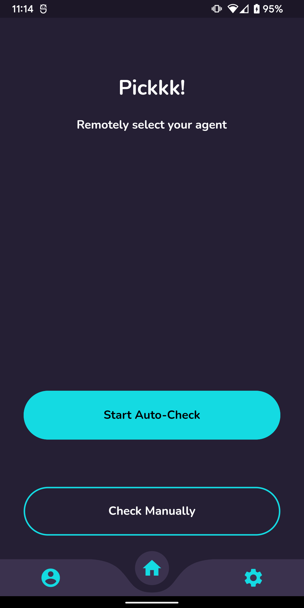
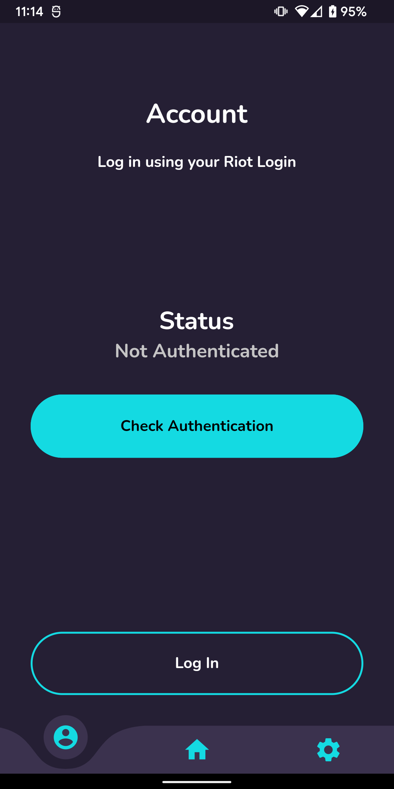
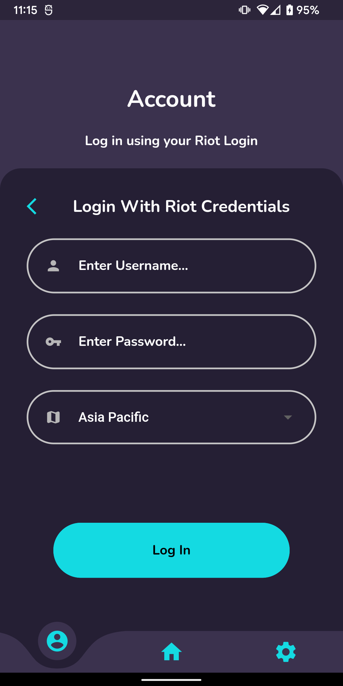

# Pickkk (Cancelled)

Pickkk was supposed to a a Flutter based app to remotely select your valorant agents. Unfortunately I became quite busy after the initial burst of development. This led to me being no longer interested in the project. Additionally there are now apps on the market that do the same thing and it seems kind of pointless for me to make another one especially since the initial goal was to not expand the app. Riot is also cracking down on the use of the API using Usernames and Passwords which makes it hard to fix when they change something. 

However this project has given me alot in terms of knowledge and experience. Here's what I've learnt from the project:

  * Basic Flutter and Dart Knowledge
  * Using and editing pub packages
  * Basic animations in Flutter
  * Explored State management tools and frameworks
  * Handelling mobile aspect ratio issues
  * and finally: I should really use API wrappers if available and stop thinking I can make better versions of them.

Also: Here's are some screenshots of the UI I managed to build:

| Home | Login Page | Login Form |
|:-:|:-:|:-:|
| 

 | 

 | 

 |

